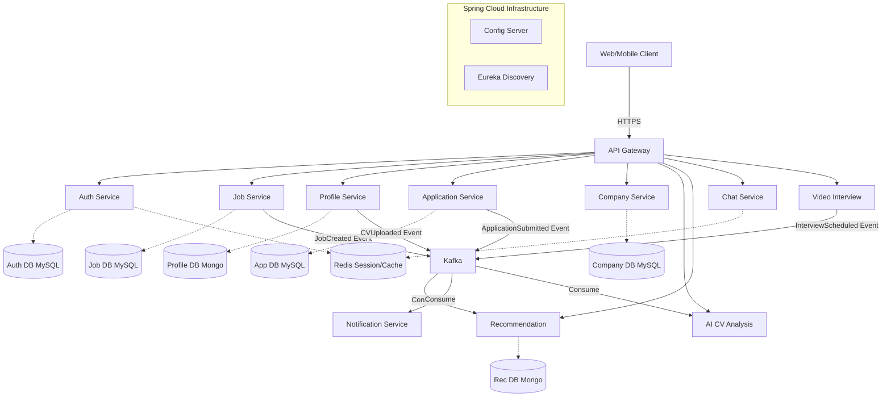

# CareerConnect AI - Architecture & Design

## Microservice Architecture & Communication

The system relies on an API Gateway as the single entry point. Internal services communicate synchronously via REST (for direct queries) and asynchronously via Kafka (for event-driven data flow).

## Technology Stack Justification
- **Spring Boot & Spring Cloud**: Robust microservice ecosystem with built-in discovery, config, and resilience.
- **API Gateway**: Provides a reverse proxy and unified API edge.
- **Kafka**: Essential for decoupled events (like triggering AI analysis only after CV upload).
- **MySQL/PostgreSQL**: Relational integrity for core transactional systems (Jobs, Users, Applications).
- **MongoDB**: Schema-less flexibility for User Profiles, rich CV JSON, and Recommendations.

## High-Level Data Flow Example: Apply for Job
1. User clicks "Apply" on UI. Request routed via API Gateway to `Application Service`.
2. `Application Service` saves application status as `Applied` in MySQL.
3. `Application Service` publishes `ApplicationSubmitted` event to Kafka.
4. `Notification Service` listens to Kafka and sends an email to the User and Company.
5. `Recommendation Service` updates user's personalized job feed based on the applied sector.
